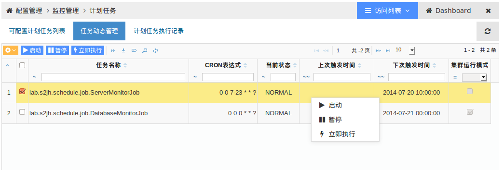

## 概要说明

Spring 3已经提供比较便捷的定时任务功能支持，如定时间隔及CRON语法支持，
但是对于企业应用应该还是离不开Quartz的所提供的Cluster支持特性。

按照Spring的主体风格，同样提供了基于Annotation注解的方式定义定时任务，但是建议不要直接把定时配置参数写死在注解中很简单道理降低了系统可维护性，
即便还是想用Annotation方式最好以动态参数方式从属性文件或数据库加载配置，以便可以随时灵活的调整定时参数。

对于定时任务这部分，在框架中除了按照常规的Spring Asynchronous & Scheduling用法外，主要从以下层面进行封装扩展：

* 框架主要基于Spring Scheduling与Quartz集成进行封装扩展,支持集群和非集群典型的定时运行模式
* 提供一个BaseQuartzJobBean，所有Quartz Job统一继承此基类，便于统一定义处理、异常处理、日志记录等
* 提供一个扩展SchedulerFactoryBean的任务加载机制，实现动态从数据库加载定时任务配置
* 提供一个扩展LoggingJobHistoryPlugin的任务历史记录插件，异步方式把执行记录写入指定数据库表，并提供UI查看界面
* 支持在XML中静态的任务定义和基于前端UI的数据库的动态任务定义
* 提供相关UI界面功能，可以实时动态配置和管理定时任务的CRON表达式、启动暂停任务、立即执行任务的操作

## 主要UI界面功能展示

* **可配置定时任务管理**： 基于数据库记录方式动态配置和实时调整运行参数


* **定时任务动态管理**： 对所有定时任务进行启动暂停和立即运行等实时管理操作



* **定时任务历史记录**： 记录查看定时任务运行记录列表和明细以及异常堆栈日志等


## 用法介绍

在prototype工程中,演示了如下几种定时任务用法,基本涵盖了企业应用比较典型的定时业务场景.

参考配置文件 prototype\src\main\resources\service\spring-schedule.xml

* 基于Spring Schedule XML配置的定时任务列表，适合定义在每台服务器节点执行并且无需日志记录、无需管理界面干预等功能支持的任务 

```xml
    <task:scheduled-tasks scheduler="springScheduler">
        <!-- 固定间隔触发任务，单位毫秒 -->
        <task:scheduled ref="systemSechduleService" method="pubPostCacheRefreshTimely"
            fixed-rate="300000" />
    </task:scheduled-tasks>
```

* 基于Spring与Quartz整合以RAM内存存储非cluster集群的任务列表，适合定义在每台服务器节点都执行的任务

```xml
    <bean id="quartzRAMScheduler" class="lab.s2jh.schedule.ExtSchedulerFactoryBean">
        <property name="schedulerName" value="quartzRAMScheduler" />
        <!-- quartz配置 -->
        <property name="configLocation" value="classpath:quartz-ram.properties" />
        <!-- 启动时延期N秒开始任务 -->
        <property name="startupDelay" value="30" />
        <!-- 保存Job数据到数据库所需的数据源 -->
        <property name="transactionManager" ref="transactionManager" />
        <!-- Job接受applicationContext的成员变量名 -->
        <property name="applicationContextSchedulerContextKey" value="applicationContext" />

        <!-- 静态Triggers配置，这些配置Trigger以固定模式运行，如果需要更新则修改配置后更新应用部署才能生效 -->
        <property name="triggers">
            <list>
                <!-- 统计数据库状态信息的定时任务，演示在集群环境中只需要任何一个节点统计执行即可 -->
                <bean id="lab.s2jh.schedule.job.ServerStatJob.Trigger"
                    class="org.springframework.scheduling.quartz.CronTriggerBean">
                    <property name="jobDetail">
                        <bean name="lab.s2jh.schedule.job.ServerStatJob"
                            class="org.springframework.scheduling.quartz.JobDetailBean">
                            <property name="jobClass" value="lab.s2jh.schedule.job.ServerStatJob" />
                        </bean>
                    </property>
                    <property name="cronExpression" value="0 0 7-23 * * ?" />
                </bean>
            </list>
        </property>
        <property name="jobBeanCfgService" ref="jobBeanCfgService" />
        <property name="runWithinCluster" value="false" />
    </bean>
```

* 基于Spring与Quartz整合并且支持cluster集群的任务列表，适合定义需要在多个服务器节点中确保同一时间只有一个任务实例执行的任务

```xml
    <bean id="quartzClusterScheduler" class="lab.s2jh.schedule.ExtSchedulerFactoryBean">
        <property name="schedulerName" value="quartzClusterScheduler" />
        <!-- quartz配置 -->
        <property name="configLocation" value="classpath:quartz-cluster.properties" />
        <!-- 启动时延期N秒开始任务 -->
        <property name="startupDelay" value="10" />
        <!-- 保存Job数据到数据库所需的数据源 -->
        <property name="dataSource" ref="dataSource" />
        <property name="transactionManager" ref="transactionManager" />
        <!-- Job接受applicationContext的成员变量名 -->
        <property name="applicationContextSchedulerContextKey" value="applicationContext" />
        <!-- 用数据库最新配置覆盖已有配置 -->
        <property name="overwriteExistingJobs" value="true" />

        <!-- 静态Triggers配置，这些配置Trigger以固定模式运行，如果需要更新则修改配置后更新应用部署才能生效 -->
        <property name="triggers">
            <list>
                <!-- 统计数据库状态信息的定时任务，演示在集群环境中只需要任何一个节点统计执行即可 -->
                <bean id="lab.s2jh.schedule.job.DatabaseStatJob.Trigger"
                    class="org.springframework.scheduling.quartz.CronTriggerBean">
                    <property name="jobDetail">
                        <bean name="lab.s2jh.schedule.job.DatabaseStatJob"
                            class="org.springframework.scheduling.quartz.JobDetailBean">
                            <property name="jobClass" value="lab.s2jh.schedule.job.DatabaseStatJob" />
                        </bean>
                    </property>
                    <property name="cronExpression" value="0 0 0 * * ?" />
                </bean>
            </list>
        </property>
        <property name="jobBeanCfgService" ref="jobBeanCfgService" />
        <property name="runWithinCluster" value="true" />
    </bean>
```   